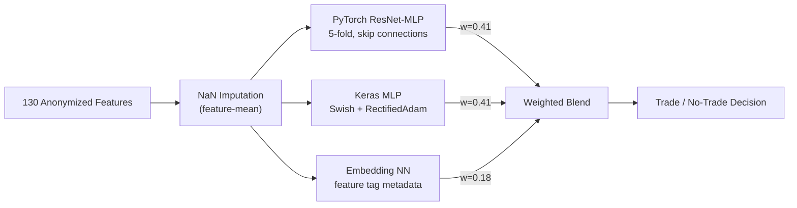

# Jane Street Market Prediction — Kaggle Competition


## Overview

The [Jane Street Market Prediction](https://www.kaggle.com/competitions/jane-street-market-prediction) competition (2020-2021) challenged participants to build a model that predicts profitable trading actions from 130 anonymized financial features. The task was binary classification (trade or don't trade), with economic significance weighted by trade importance.

Kaggle profile: [illidan7](https://www.kaggle.com/illidan7)

## Approach

### 1. Gradient-Boosted Tree Baselines

Started with XGBoost classifier as the initial baseline, establishing feature importance rankings across the 130 anonymized features. Experimented with risk-aware prediction thresholds — scaling confidence requirements by trade weight so higher-weight trades required more certainty.

### 2. Custom Loss Functions for Class Imbalance

Implemented Focal Loss with custom gradient/hessian for LightGBM in a One-vs-Rest wrapper. This down-weights easy-to-classify samples to focus learning on harder boundary cases near the decision boundary.

### 3. Neural Network Pipeline with Hyperparameter Optimization

Built a full PyTorch MLP training pipeline with:
- GroupTimeSeriesSplit cross-validation (respecting temporal ordering)
- Optuna hyperparameter optimization across network depth, width, dropout, and learning rate
- 5-fold training with per-fold model checkpointing
- Feature-mean NaN imputation computed from training data

### 4. Multi-Framework Ensemble

Final submission blended three diverse model families with optimized weights:
- **PyTorch ResNet-MLP** (weight: 0.41) — 5-fold with dense skip connections
- **Keras MLP** (weight: 0.41) — Swish activation + RectifiedAdam optimizer
- **Embedding NN** (weight: 0.18) — leveraged competition-provided feature tag metadata to create learned feature embeddings, enriching raw features with structural relationships

## Results

| Model | Ensemble Weight | Notes |
|---|---|---|
| XGBoost baseline | — | Initial baseline, feature importance |
| LightGBM + Focal Loss | — | Custom gradient/hessian, One-vs-Rest |
| PyTorch ResNet-MLP | 0.41 | 5-fold, dense skip connections |
| Keras MLP | 0.41 | Swish activation + RectifiedAdam |
| Embedding NN | 0.18 | Learned feature tag embeddings |
| **Final 3-Model Ensemble** | — | Utility-score optimized |

## Architecture



## Repository Structure

```
└── notebooks/
    ├── 01-xgboost-baseline.ipynb                 # XGBoost baseline with feature importance
    ├── 02-lightgbm-focal-loss-ovr.py             # Custom Focal Loss + One-vs-Rest LightGBM
    ├── 03-pytorch-optuna-training.ipynb           # PyTorch MLP with Optuna HPO + GroupTimeSeriesSplit
    └── 04-ensemble-resnet-keras-embeddingnn.ipynb # Final 3-model ensemble with feature tag embeddings
```

## Tech Stack

- **Models**: XGBoost, LightGBM, PyTorch MLP (ResNet-style), Keras MLP, Embedding NN
- **Optimization**: Optuna (hyperparameter search), custom Focal Loss
- **Cross-Validation**: GroupTimeSeriesSplit (temporal ordering)
- **Infrastructure**: Kaggle Notebooks (GPU)

## Competition

- **Name**: [Jane Street Market Prediction](https://www.kaggle.com/competitions/jane-street-market-prediction)
- **Type**: Binary classification (trade action prediction)
- **Metric**: Utility score (weighted by trade action profitability)
- **Timeline**: November 2020 — August 2021
